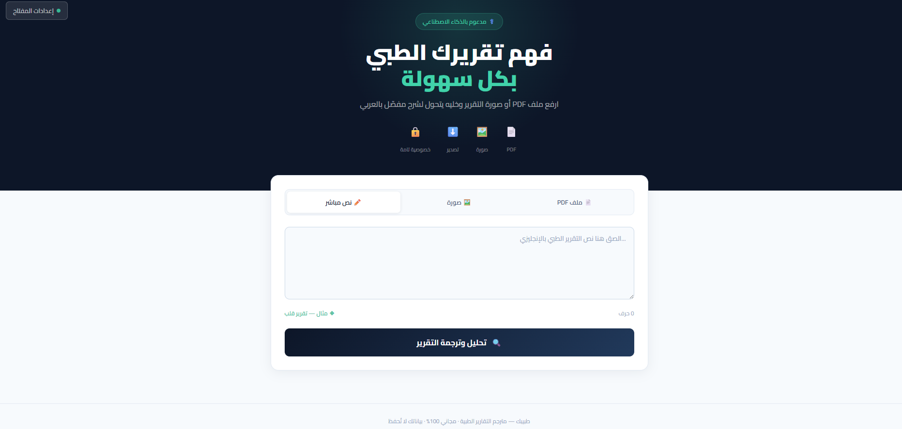

# medical-translator-v2
# ⚕️ Medical Translator — AI Medical Report Analyzer

🚀 **Medical Translator** is a powerful web-based tool that helps users **understand complex medical reports بسهولة وبالعربي** using AI.

👉 GitHub Repository: https://github.com/aboseham3/medical-translator

---

## ✨ Overview

This project allows users to upload medical reports in different formats and get a **clear, structured, and simplified explanation** in Arabic.

The tool focuses on making medical information **easy, fast, and accessible for everyone** — not just doctors.

---

## 🔥 Features

* 📄 **PDF Upload**

  * Supports text-based medical reports
  * Extracts and analyzes content automatically

* 🖼️ **Image Recognition**

  * Works with scanned reports (JPG, PNG, WEBP)
  * Uses AI to read and interpret medical data

* ✏️ **Direct Text Input**

  * Paste medical reports manually
  * Instant analysis and translation

* 🧠 **AI Analysis**

  * Simple Arabic summary
  * Key findings breakdown
  * Lab results interpretation
  * Medical terms explained
  * Suggested next steps

* 📊 **Smart UI Output**

  * Clean dashboard layout
  * Easy-to-read sections
  * Visual indicators for results

* ⬇️ **Export Options**

  * Download report as PDF
  * Save as HTML

* 🔒 **Privacy First**

  * No backend server
  * API key stored locally in browser
  * No data storage ([GitHub][1])

---

## 🧰 Technologies Used

* HTML5 + CSS3 🎨
* Vanilla JavaScript ⚡
* PDF.js — Extract PDF text
* html2pdf.js — Export reports
* Claude AI API 🤖

---

## ⚙️ Setup & Usage

1. Clone the repository:

```bash
git clone https://github.com/aboseham3/medical-translator.git
cd medical-translator
```

2. Open `index.html` in your browser

3. Get your API key:
   👉 https://console.anthropic.com/settings/keys

4. Paste the API key inside the app (Settings button)

---

## 🧪 How It Works

1. Upload PDF / Image or paste text
2. The app extracts the content
3. Sends it to AI for processing
4. Receives structured JSON response
5. Displays a full medical explanation

---

## ⚠️ Limitations

* Scanned PDFs without text may not work (use Image mode instead)
* AI accuracy depends on report quality
* Not a replacement for professional medical advice

---

## 📌 Use Cases

* 🏥 Patients understanding their reports
* 👨‍⚕️ Doctors explaining results
* 📚 Medical students
* 🌍 Arabic users with English reports

---

## 🛡️ Disclaimer

> This tool is for educational purposes only and does not replace consultation with a licensed healthcare professional.

---

## 💡 Future Improvements

* Multi-language support 🌐
* Voice explanation 🎤
* Mobile app 📱
* Doctor recommendation system 🏥

---
 Website   https://aboseham3.github.io/medical-translator/
---

## 👨‍💻 Author

Developed by **Sami Alsayed** 🚀

---

## ⭐ Support

If you like this project, give it a ⭐ on GitHub and share it!

---

[1]: https://github.com/Nadika18/Medical_Jargon_Simplification?utm_source=chatgpt.com "GitHub - Nadika18/Medical_Jargon_Simplification: This app simplifies the complex medical jargons written in text, medical reports into simple terms that the normal person can understand it."
